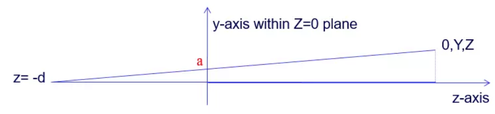

# Computer Graphics

3D物体从三维坐标映射到2D屏幕上，要经过一系列的坐标系变换

1.model

物体本身（local）的坐标系，是相对坐标。
比如一个3D人物模型，头部某个点的坐标为（0，0，20），这是相对该模型的中心点（0，0，0）说的。当模型向前移动了5个单位，其中心点依旧是（0，0，0），头部那个点依旧是（0，0，20）

2.world

世界坐标系，即物体放在世界里的坐标，也就是大家最能理解的那个坐标。
还是上面的例子，他沿Z轴移动了5个单位后，中心点在世界坐标里变成了（0，0，5），头部那个点变成了（0，0，25）。
物体的位移，缩放，旋转会改变它的世界坐标，不会改变它的model坐标。

3.image

相机坐标系。
相机也是世界里的一个物体，相机坐标就是以相机位置为坐标原点，相机的朝向为Z轴方向的坐标系。因为我们在电脑里看到的物体其实都是“相机”帮助我们看的，“相机”就是我们的眼睛，所以要以相机为标准进行坐标转换。
在model，world，image坐标系下，X,Y,Z的范围都是无穷大，只是坐标系的基准不一样而已。

4.perspective

透视坐标系。
这一步是将三维坐标向二维平面进行映射，经过透视变换之后，（x, y）的范围在[-1, 1]，z的范围在[0, 1]。

5.screen

屏幕坐标系。
因为屏幕是有分辨率的，比如1920×1080，所以还要再进行一次变换。
该坐标系的原点在屏幕左上角，x轴朝右，y轴朝下。x的范围在[0, xres-1]，y的范围在[0, yres-1]，即x是[0, 1920)，y是[0, 1080)。
z值是[0, MAXINT]，z=0就是屏幕那个平面，z=MAXINT就是无穷远。

## 坐标系的变换矩阵

1.从model变到world
从模型本身的相对坐标变换到世界坐标，就是平移，旋转，缩放。

2.从world变到image（相机坐标）
这一步是将物体在世界的坐标转换为相对相机的坐标。
相机也是世界里的物体，我们假定相机的中心点在世界里的位置是C（Cx, Cy, Cz）
相机正在看着某个方向，我们假定相机正在看的点的位置是I（Ix, Iy, Iz）
那么，相机的Z轴就是它看的方向的向量，即CI向量，也就是I - C = （Ix-Cx, Iy-Cy, Iz-Cz），我们将其标准化（即让它的模为1），得到Z轴单位向量。

得到Z轴后求X, Y轴有两个方法：
方法1：
通过up叉乘Z（注意顺序），我们可以得到一个向量X1，将X1标准化（即使其模为1），我们就得到了X轴的单位向量。
在通过Z轴的单位向量与X轴的单位向量叉乘，即Z×X（注意顺序），我们就得到了Y轴的单位向量。
方法2：
up' = up - (up·Z)Z
注意：（Z的模是1）
将up'标准化得到Y，Y×Z = X
然后我们就可以构造Xiw这么一个将世界坐标系投影到相机坐标系的变换矩阵了。

如何构造？
1）世界坐标系中，相机原点为（Cx, Cy, Cz），在相机坐标系中为（0，0，0）
所以，（0, 0, 0） = Xiw*（Cx, Cy, Cz）
2）世界坐标系中，相机的三个轴为X+C（Xx+Cx, Xy+Cy, Xz+Cz）, Y+C（Yx+Cx, Yy+Cy, Yz+Cz）, Z+C（Zx+Cx, Zy+Cy, Zz+Cz），但在相机坐标系下为（1，0，0），（0，1，0），（0，0，1）
所以
（1, 0, 0） = Xiw*（Xx+Cx, Xy+Cy, Xz+Cz）
（0, 1, 0） = Xiw*（Yx+Cx, Yy+Cy, Yz+Cz）
（0, 0, 1） = Xiw*（Zx+Cx, Zy+Cy, Zz+Cz）

## 从image变到perspective

当x=0时，yz平面如上图所示。
z = -d是我们的观察点，而Z=0就是相机的胶片，或者我们的视网膜，场景要投射到Z=0这个二维平面上。
我们需要将在相机坐标系里的（0，Y，Z）这个点投到Z = 0这个平面上，即a点，a点坐标为（0，y，0）。
根据三角形相似可知：
y/d = Y/(Z+d)
y = Yd/(Z+d) = Y/[(Z/d)+1]
我们对X和Z做同样的操作，最终，一个相机坐标系里的点（X, Y, Z）会变成
（X/[(Z/d)+1]，Y/[(Z/d)+1]，Z/[(Z/d)+1]），这样就投射到了Z=0这个平面上了。

注意
我们也不一定非要投到Z=0这个平面，投到Z=1,Z=d的平面都可以，式子是一样的。

我们可以看出来，这个变换就是将坐标除了一个(Z/d)+1。
因此，将四维坐标转换为Perspective坐标的变换矩阵为

经过该矩阵变换之后的四维坐标为（X, Y, Z, Z/d+1），转换为三维坐标即为（X/[(Z/d)+1]，Y/[(Z/d)+1]，Z/[(Z/d)+1]）

Perspective矩阵的定义的X, Y的范围在[-1,1]，而X/[(Z/d)+1]，Y/[(Z/d)+1]的范围是负无穷到正无穷，所以一旦X/[(Z/d)+1]，Y/[(Z/d)+1]超出[-1, 1]的范围，就直接扔掉不显示在屏幕上了。

Perspective矩阵定义的Z的范围在[0,1]，所以还要将Z进一步限制，所以最终的矩阵为

这样子z的值就成了(Z/d)/[(Z/d)+1]，即1/[1+d/Z]，满足[0,1]这个范围了。
而这个d又是多少呢？

FOV (Field of View)是定义相机视锥垂直方向（y轴方向）的张角（它是个角度），该张角与Z=0这个投影平面的交点是-1和1，因为x，y的范围是[-1,1]。
从上图可以看出，1/d就是tan（FOV/2）
4. 从perspective变到screen
定义屏幕分辨率为xs × rs
要将透视坐标系里的点映射过来，这个变换矩阵怎么构造？(参考Xiw)
1）首先我们先构造一个4维标准矩阵，即对角线都是1，其余都是0。
2）屏幕坐标系的原点是左上角，而perspective里的原点（0，0）在屏幕中应该位于屏幕中央，即（xs/2, ys/2）。那么perspective里的原点（0，0）会映射为（xs/2, ys/2），即位移一个（xs/2, ys/2，0）。
所以4维矩阵的最后一列是（xs/2, ys/2，0，1）
3）屏幕坐标系中x的范围是[0, xs)，y的范围是[0, ys)。而Perspective坐标系中x和y的范围是[-1,1]，所以这个映射还要满足-1映射到0，1映射到xs或ys。
目前为止，我们的4维矩阵变成了这样：

注意：我们可以很明显的发现矩阵第二行第二列是负的，这是因为之前的坐标系都是y轴正方向朝上的，而屏幕坐标系是y轴正方向朝下的，是反的，所以是负号，即perspective里的-1映射到屏幕里的ys，1映射到屏幕里的0。
4）屏幕坐标系中z的范围是[0, MAXINT]，Perspective坐标系中z是[0,1]，所以再对z进一步限制，即1映射到MAXINT，得到最终结果。

所以，一个3D物体显示到电脑屏幕上，要经过4重坐标系变换。
screen Xsp perspective (NDC) Xpi image Xiw world Xwm model
在实际的渲染引擎运行中，Xsp和Xpi基本不会变，因为你的屏幕分辨率很少会变动。Xiw会在相机移动和旋转时改变。Xwm会在物体平移，旋转，缩放时改变。